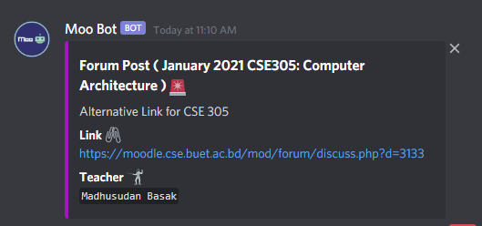
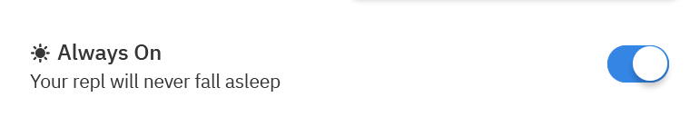

# `MooBot` :cow::robot:
Notification for BUET Moodle

Are you tired of checking Moodle every now and then for the latest and greatest offline ? :cold_sweat: or Are you secretly reloading Moodle every now and then to check if the marks of the best CT you gave last week has been uploaded yet or not  :grimacing:

Introducing `MooBot` , here to easen your panic attacks .

MooBot is a notification bot for our Moodle . It sends 2 kinds of notification :
- `Forum Post`
  - Any time a teacher posts something in the forum
    
    

- `New Activity` 
  - Any time Resource / Assignment / Submission Link is uploaded in the course section

    

# Usage

Currently `MooBot` serves the CSE17 Discord server . The bot code and scrapper code is available [here](MooBot/) . You can make your own custom one or one for your batch by changing the 

- bot id
- channel id

# Deploy

The easiest way to deploy `MooBot` is using [repl.it](https://replit.com) . Create a repl and clone the repo . Run [moobot.py](MooBot/moobot.py) , and you are done ! To make sure your server is up and running , use the **always on** feature available in repl.it student account .

Also make sure you repl is private so that any personal information is not breached .

Alternatively you can also create a server . This [link](https://www.codementor.io/@garethdwyer/building-a-discord-bot-with-python-and-repl-it-miblcwejz#keeping-our-bot-alive) explains the steps.
  