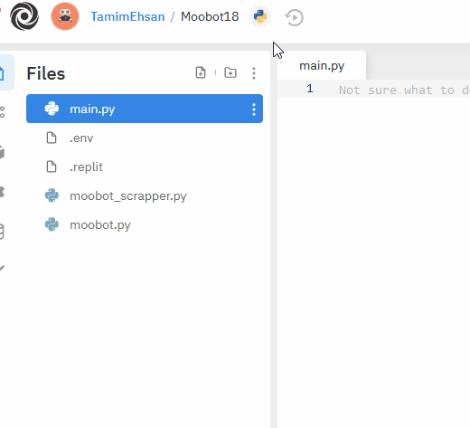
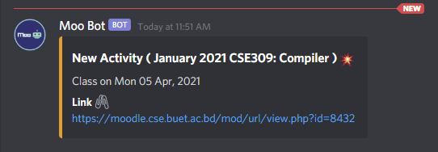

## Step by Step tutorial for Moooooooobot :cow:  :robot:

### Download the code

Download the Moobot codes from [here](MooBot/).

It will have 3 files. 

1. .ev
2. moobot.py
3. moodle_scrapper.py

### Creating a RepltIT account

We will upload the server in [ReplIT](https://replit.com/~) . Using github student account we can access premium features from this site. 

After sign up we will head to home page. 


Create new repl with python. Make it private and rename as your choice and hit enter. And done.

### Uploading Codes

Head to you new repl and upload the 3 files mentioned above. Here for repl we need to add another file. 

Create a new file and name it `.replit`  and add the following codes

```json
language = "python3"
run = "python3 moobot.py"
```

Don't click the run yet. We still have work to do.

### Creating a discord bot

Now we need to create a discord bot.

Follow this blog on [How to Create a Discord Bot for Free with Python](https://www.freecodecamp.org/news/create-a-discord-bot-with-python/) .

Then get your bot token from the bot section and copy the token.


Go to the `.env` file and set the TOKEN there with no quotes :3. 

### Getting Facebook Graph API Token (optional)

If you don't want to integrate facebook graph api you can ignore this part.

You might need admin access to the facebook group. I am not sure about that. But you need a [facebook developer account](https://developers.facebook.com/docs/development/register/). Then follow this detailed tutorial on [How to generate a graph api token](https://www.jcchouinard.com/facebook-graph-api-get-access-token/)

After that head to `.env` and paste the token in FB_TOKEN field. 

### Getting other information

- Discord Channel ID

  Get the discord channel id from your server. [How to find channel ID on discord](https://github.com/5andr0/PogoLocationFeeder/issues/64#issuecomment-236785757). You want to ask the server admin to do it for you.

- Facebook Group ID

  Go to your group and copy the group id from the link bar above.

- Moodle login information

  Get the login information of any one of the student. And edit the variables for student id and password in `moobot.py`

So after that you should have the following data

```python
STUDENT_ID = "1805xyz"
LOGIN_PASSWORD = "password"
CHANNEL_ID = 825139612806237565
GROUP_ID = 496455517759364
```

### Final touch

If you don't want to integrate facebook group api then remove all codes from `moobot.py` for that. Otherwise you might get unnecessary errors.

Go though the codes and check for any errors.  Make the repl set to run always



And then run. And you are done 

### Testing 

To test the project, head to `moobot.py` and find the following codes in the last section

```python
write_old_forum_posts(course_dict,session)
write_old_activities(course_dict,session)
```

Comment out this two line and in any of the newly generated text files you can see in files folder remove one or two entries. And run again. You should see the message now like this. 



You are good to go. Uncomment those lines and run again. 

### Conclusion

After first dry run you might get http block from discord. It will be solved automatically after sometime. 

The facebook token has a short validity of two months. After that you need to revalidate the token. A better solution will be provided later. 


> Tutorial written by
>
> [Md. Tamimul Ehsan](https://github.com/TamimEhsan)

